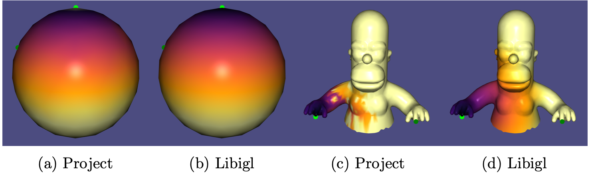
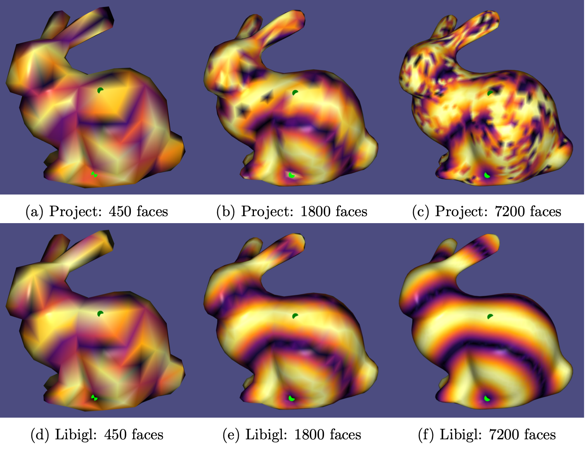

# geodesic

Implementation of the paper "Fast Exact and Approximate Geodesics on Meshes" BY Surazhsky et al. as part of the INF574 - Digital Representations and Analysis of Shapes. Project colloboration between Romain Egele and Jeremy Gozlan.

<!-- .element height="50%" width="50%" -->
<!-- .element height="50%" width="50%" -->
